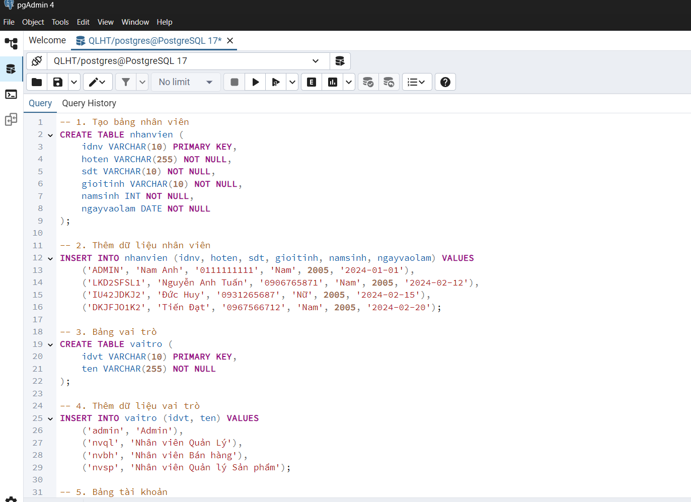
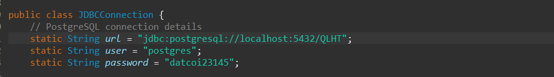
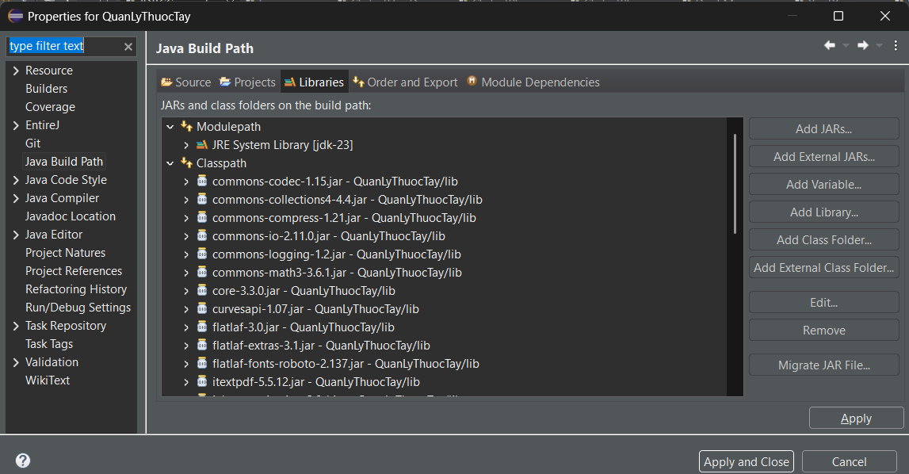

## Môn: Lập trình hướng đối tượng
## Đề tài: **Quản lý Hiệu Thuốc tây**

>
## Technology
- Java
- PostgreSQL
- Eclipse

## Getting Started
1. Tải source code:
```sh
git clone https://github.com/nguyendat160305/Nhom_OOP_Prj
```
2. Copy nội dung file oop_database.sql sau đó dán vào query trong pgAdmin 4 để tạo database 


3. Sử dụng **Eclipse** chọn **File -> Import Project**
4. Sửa phần têm database và mật khẩu trở thành của bạn 
ví dụ tên database là QLHT, mật khẩu là datcoi23145
 
5. Thêm toàn bộ các thư viên trong libs ở phần build path

6. Run project ở file **Login.java**


